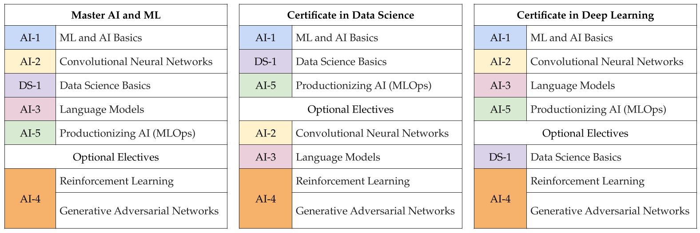

Welcome to the ever growing Univ.AI community!

These are our courses we offer. You can sign up for them at the [Programs](https://univ.ai/programs) page on our website.

1. PyDS: the basics of Python and its numerical programming stack as required for all other courses 
2. Master ML & AI
3. Certificate in Data Science
4. Certificate in Deep Learning

You can also take individual modules. We offer the flexibility you need!  

The upcoming three cohorts will follow the schedule below.  

If you have already signed up, congratulations! You are embarking on a transformative AI and Data Science journey. 

Your mentors and professors will repeat: the best way to “learn AI” is to do. Expect to put in a lot of hard work, a lot of practice. It is not easy, but you will find that it is fun.

You will need to put in the hours, and keep up with your assignments. We, and your peers, will help you each step of the way. We will ensure that you get the most from your time with us.  

Seek out mentors you like and trust, and never be afraid to ask for some of their time. Use your “break out” time to discuss problems with your peers & TAs.

This website outlines the resources available to you as part of your Univ.AI membership. You will find the schedule for your classes, and the various resources (forums, github, chat) available to you. You will find information about our platform, and the software you need to install. 

If there is anything we can do to help you better navigate your learning journey, we hope you will let us know. If you encounter any problems, please reach out. And if you want to talk about life, the universe, and everything, we are here for that too.

We hope that your journey will be one of great growth. Here's to a happy, healthy, and fruitful year.

*Siddharth Das & Dr. Rahul Dave, founders @Univ.AI*

